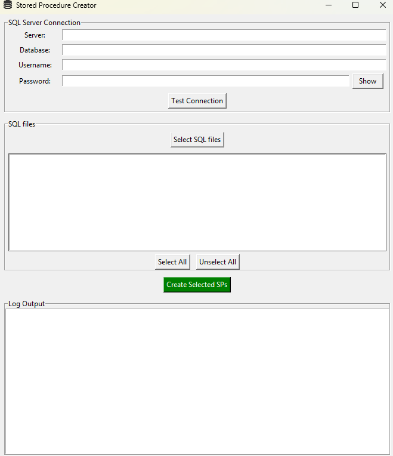

# Auto Execute SQL Scripts in SQL Server

If you have problem with creating a lot of Stored Procedures (or any other `.sql` scripts) on serveral databases, you are in the right place!

You can see the app in this path `app\auto_sp_creation.exe`
This app reads `.sql` files from a specified directory and executes them on a Microsoft SQL Server database. It supports encoding detection and batch execution using `pyodbc`.



## Features

- **Dynamic Database Selection**: you can target database name and SQL login for the server.

- **Test connection**

- **Select the files**: select the `.sql` files you want.
- **Error Handling**: Logs execution errors without stopping the entire process.

## Requirements

- `Python 3.x`
- `pyodbc`
- `chardet`
- `Microsoft ODBC Driver for SQL Server`

## Installation

1. Clone this repository:
   ```sh
   git clone https://github.com/itsCharlesAM/auto_sp_creation_app.git

2. Install dependencies:
   ```sh
   pip install -r requirements.txt

3. (Optional) Build executable (Windows only)
   ```sh
   pip install pyinstaller
   pyinstaller --onefile --noconsole main.py

4. The executable will be available in the `dist` folder:
   ```sh
   dist/main.exe
## Usage
1. Fill the your SQL Server credentials in SQL Server Connection section.
then you can test the connection.

2. select the file you want to execute and Done!

## Notes
- Ensure the `.sql` files in your directory are correctly formatted.
